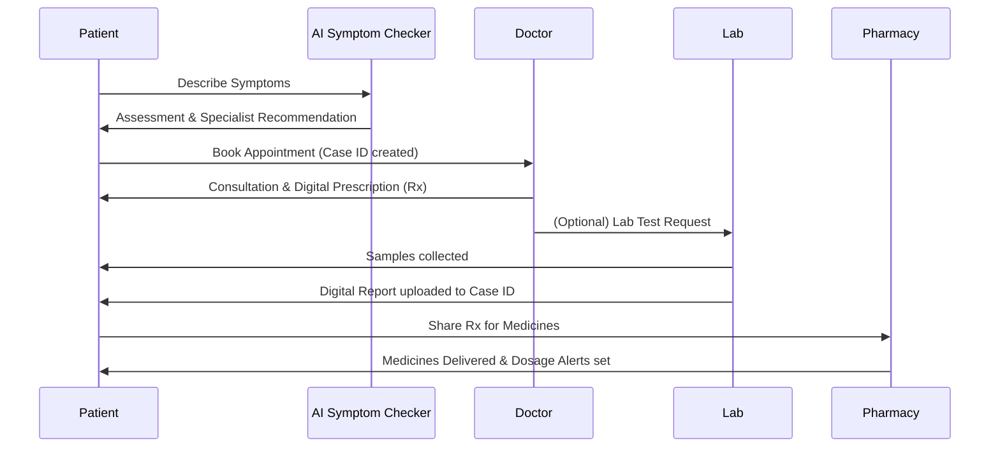

# Deliverable 1: Product Overview

## What is Arogyadatha?
**Arogyadatha** is a premium, unified digital healthcare platform designed to bridge the gap between patients, doctors, diagnostic labs, and pharmacies. Its core mission is to provide a "Full Journey" healthcare experience where all health data, appointments, and prescriptions are managed in a single, secure mobile environment.

## The Problem Being Solved
Indian healthcare is currently fragmented, leading to several critical issues:
1.  **Scattered Reports**: Medical history is often lost or left behind in hospital files, making it impossible for doctors to see the "big picture."
2.  **Lack of Clarity**: Patients often don't understand their medical reports or the severity of their symptoms.
3.  **Inefficiency**: Long waiting times, repeated tests due to lost reports, and a lack of proper follow-up systems.
4.  **Information Gap**: Doctors don't have access to a patient's full clinical history, leading to potentially suboptimal treatment.

## Core Business Model
Arogyadatha operates as a **Digital Health Network (DHN)**. It aggregates verified healthcare providers (doctors, labs, pharmacies) and provides them with digital tools to connect with patients.
*   **Verification-Led**: Every provider on the network is verified.
*   **Continuity of Care**: The platform uses a unique **Case ID** system to track a specific medical issue from symptoms to recovery.

## How Patients Use It
Patients are the center of the Arogyadatha ecosystem:
1.  **Health ID**: Every patient gets a unique Health ID and Case ID for each illness.
2.  **Symptom Checker**: Use AI-powered tools (Gemini AI) to understand symptoms in simple Telugu or English.
3.  **Booking**: Seamlessly book verified doctors for online or offline consultations.
4.  **Health Journey**: Track the entire progress of a case — from the first doctor visit to lab tests and pharmacy orders.
5.  **Digital Archive**: Never lose a report again. All lab results and prescriptions are automatically linked to the Case ID.

## How Partners Connect
*   **Doctors**: Manage their schedule, view patient clinical history (with authorization), and issue digital prescriptions.
*   **Labs**: Receive test requests, upload digital reports directly to the patient's Case ID, and manage billing.
*   **Pharmacy**: Receive prescriptions directly from patients, manage medication delivery, and provide dosage alerts.
*   **Admin/Super Admin**: Oversee the network, verify providers, and monitor system health.

## End-to-End Workflow

## Vision
To make **Andhra Pradesh the Digital Capital of India** by ensuring every citizen carries their full health history in their pocket, ensuring "Right Disease + Right Doctor + Right Treatment."
