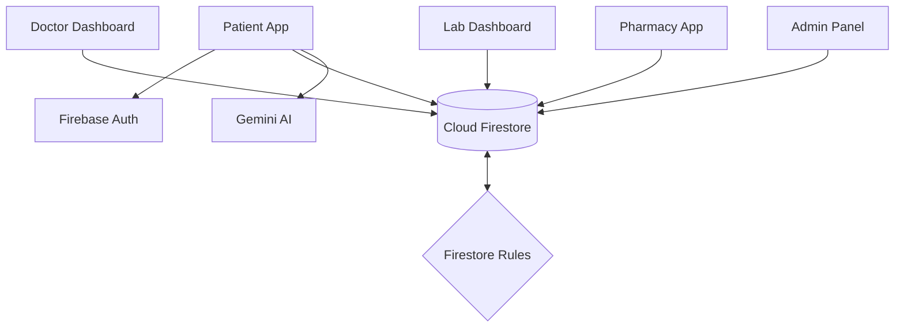

# Deliverable 2: Full System Architecture

## Architecture Overview
Arogyadatha is built as a **Single Page Application (SPA)** following a modern serverless architecture. It relies heavily on **Firebase** for backend services (Authentication, Database, Storage) and **Vite/React** for a high-performance frontend.

## 1. Frontend Architecture
*   **Framework**: React 19 (functional components, hooks).
*   **Routing**: Client-side routing handled via `react-router-dom`.
*   **State Management**: Combination of React `useState`/`useEffect` and Firebase `onSnapshot` for real-time data synchronization.
*   **UI/UX Layer**:
    *   **TailwindCSS**: Utility-first styling.
    *   **Lucide React**: Iconography.
    *   **Motion (Framer Motion)**: For fluid, premium animations and transitions.
    *   **Shadcn UI**: Base component library for consistency.
*   **Lazy Loading**: Components like dashboards and specialized tools are lazy-loaded using `React.lazy` to keep the initial bundle size small and improve performance.

## 2. Backend Architecture (Serverless)
*   **Authentication**: Firebase Auth (Email/Password, Google OAuth).
*   **Database**: Google Cloud Firestore (NoSQL Document Store).
*   **Logic Layer**: Service-oriented architecture (e.g., `caseService.ts`) that interacts directly with Firestore from the client using secure Firebase SDKs.
*   **Storage**: Firebase Storage (for medical reports and profile images).
*   **AI Engine**: Integrated via `@google/genai` (Gemini Pro/Flash) for symptom analysis and report explanation.

## 3. Data Flow Diagram

## 4. Role-Based Access Control (RBAC)
The application enforces strict role segregation through:
1.  **Frontend Guards**: The UI conditionally renders components based on the `user.role` stored in the user's profile.
2.  **Backend Rules**: `firestore.rules` ensures that:
    *   **Patients** can only read/write their own cases and reports.
    *   **Doctors** can view shared clinical history but only for authorized cases.
    *   **Labs/Pharmacies** have specific access to requests directed to them.
    *   **Admins** have broader visibility for system maintenance.

## 5. Workflow Logic: The Case ID System
A critical architectural feature is the **Sequential Case ID**. 
*   Unlike random UIDs, Case IDs are sequential per patient (e.g., `CASE-001`, `CASE-002`).
*   This is achieved using a **Transaction-based Counter** in Firestore (`caseService.ts`) to prevent race conditions during concurrent case creation.
*   The Case ID acts as the "Glue" that binds appointments, reports, and prescriptions together.

## 6. Real-time Sync
The system uses **Snapshot Listeners** (`onSnapshot`). This means when a lab uploads a report, the patient's dashboard and the doctor's view update **instantly** without a page refresh.
