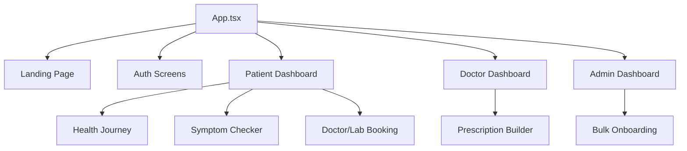

# Deliverable 8: Folder & Codebase Structure Map

Arogyadatha follows a clean, modular structure designed for scalability and role-based maintenance.

## 1. Root Directory
*   `index.html`: Main entry point for the browser.
*   `package.json`: Dependency management and scripts.
*   `vite.config.ts`: Build and development configuration.
*   `firestore.rules`: Critical database security configuration.
*   `firebase.json`: Firebase deployment and hosting settings.

## 2. `src/` (Source Code)
The heart of the application.

### `src/components/` (UI Layer)
Organized by role and functionality:
*   **`admin/`**: High-level system management (Stakeholder onboarding, stats).
*   **`doctor/`**: Doctor-facing tools (Dashboard, Rx builder).
*   **`lab/`**: Diagnostic center tools (Report upload, test management).
*   **`pharmacy/`**: Retailer tools (Medicine orders).
*   **`patient/`**: The largest module (Booking, Journey, Symptom checker, Chatbot).
*   **`landing/`**: Marketing site and founder contact pages.
*   **`ui/`**: Reusable base components (Buttons, Inputs, Cards).
*   **`common/`**: System components (Loading screens, Error boundaries).

### `src/services/` (Logic Layer)
*   `caseService.ts`: Core business logic for Case management and transactions.

### `src/lib/` (Infrastructure)
*   `firebase.ts`: Initialization and export of Auth and Firestore instances.
*   `seedData.ts`: Development tools for populating the database.

### `src/types.ts`
Centralized TypeScript interface definitions for all data models (User, Case, Appointment, etc.).

### `src/App.tsx`
The primary application orchestrator. Handles:
*   Global Routing.
*   User Authentication State.
*   Role-based conditional rendering.
*   Global UI states (Language, Theme, Search).

## 3. Other Key Directories
*   **`public/`**: Static assets like logos and manifest files.
*   **`scripts/`**: Automation scripts for build and deployment.
*   **`dist/`**: Generated production bundle (after running `npm run build`).

## 4. Component Mapping (High Level)

